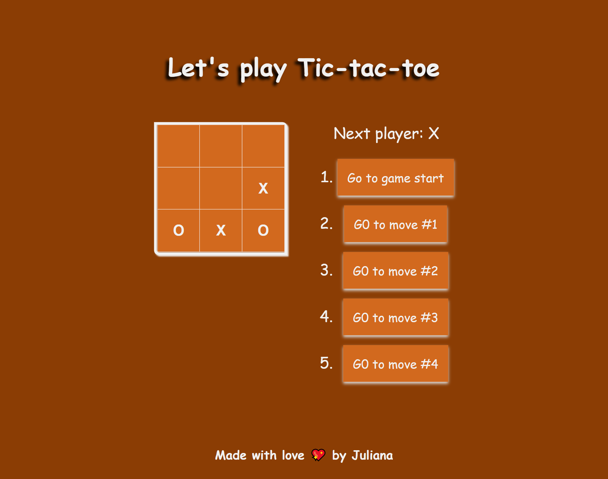

# Tic-tac-toe

> Tic-tac-toe, noughts and crosses, or Xs and Os, is a game for two players, X and O, who take turns marking the spaces in a 3×3 grid. The player who succeeds in placing three of their marks in a diagonal, horizontal, or vertical row is the winner

## Built With

- React
- JavaScript
- Webpack
- Jest
- Babel
- CSS

## Live Demo
Visit the live demo [here](https://julie-ify.github.io/tic-tac-toe/)

## Description
- This app lets you play tic-tac-toe,
- Indicates when a player has won the game,
- Stores a game’s history as a game progresses,
- Allows players to review a game’s history and see previous versions of a game’s board.

## Getting Started

### Setup

#### To get a local copy up and running follow these simple example steps.

- Click the green `Code` button on the repo
- In your local PC, open your terminal in the folder you would like to clone the project.
- Clone the repo with the command: `git clone (copied link)`; like so: `git clone git@github.com:julie-ify/tic-tac-toe.git`
- On the terminal, navigate into the directory like so: `cd tic-tac-toe`
- Checkout to branch name like so: `git checkout [branch name]`
- Run `npm i` to install the dependencies
- Run `npm start` to start the application

### Usage

- Running `npm start` should start the server and open the file on your default browser
- Start playing tic-tac-toe

## Author

👤 **Juliana Ifionu 💖**

- [GitHub](https://github.com/julie-ify)
- [LinkedIn](https://www.linkedin.com/in/e-ifionu/)

## 🤝 Contributing

Contributions, issues, and feature requests are welcome!

Feel free to check the [issues page](https://github.com/julie-ify/tic-tac-toe/issues).

## Show your support

Give a ⭐️ if you like this project!

## Acknowledgments

- Hat tip to [Reactjs](https://reactjs.org/tutorial/tutorial.html#setup-for-the-tutorial)
- [Microverse](https://github.com/microverseinc)